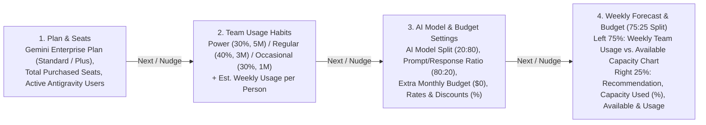

# Antigravity in Gemini Enterprise Usage Simulator

**Self link:** [go/agy-ge-usage-simulator](http://goto.google.com/agy-ge-usage-simulator)  
**Visibility:** Confidential  
**Status:** Draft  
**Authors:** [Mohan Sridharan](mailto:mohansridharan@google.com)  
**Contributors:** N/A  
**Team:** Google Cloud — JAPAC AI & Agentic Coding Enablement  
**PRD:** This document (PRD and design combined)  
**Tracking Buganizer issue/hotlist:** N/A  
**Last major revision:** 2026-10-07

---

# Context

## Objective

Provide Customer Engineers (CEs), Solution Architects, and enterprise IT administrators with a self-contained, interactive browser-based **Antigravity in Gemini Enterprise Usage Simulator** that models weekly token capacity and developer consumption across the working week (`Monday`–`Friday`).

The simulator answers four operational questions across four dedicated tabs (`1. Plan & Seats` $\rightarrow$ `2. Team Usage Habits` $\rightarrow$ `3. AI Model & Budget Settings` $\rightarrow$ `4. Weekly Forecast & Budget`), guided by a **step-by-step wizard** that presents two floating buttons (**Back** and **Next**) on the UI and triggers a **UI nudge** prompting the user to advance to the next screen whenever fields in the current tab are updated:

1.  **1. Plan & Seats:** Given the customer's **Gemini Enterprise Plan** (`Standard` at \$10/seat/mo or `Plus` at \$15/seat/mo), **Total Purchased Seats** ($N_{\text{licenses}}$), and **Active Antigravity Users** ($N_{\text{AGY}} \le N_{\text{licenses}}$), what are the **Total Weekly Team Capacity** and **Average Weekly Capacity per Active User**?
2.  **2. Team Usage Habits:** How does splitting active Antigravity users across **Power Users (Heavy)**, **Regular Users (Moderate)**, and **Occasional Users (Light)** (default `30%–40%–30%`) with configurable **Estimated Weekly Usage per Person** (default `Power: 5M`, `Regular: 3M`, `Occasional: 1M` tokens/user/week) impact **Total Estimated Team Usage / Week**?
3.  **3. AI Model & Budget Settings:** How do the **AI Model Split (Complex Reasoning vs. Everyday Tasks)** (`Gemini Pro` vs. `Gemini Flash`, default `20:80`), the **Prompt vs. Response Ratio (Input vs. Output)** (default `80:20`), **Extra Monthly Budget (Optional)** (default \$0), model rates (\$/1M tokens), and independent **Gemini Pro & Gemini Flash Discount (%)** widgets shift the **Overall Average Cost per 1M Tokens** and weekly capacity?
4.  **4. Weekly Forecast & Budget:** In a **75:25 vertical split**, how does the **Running Weekly Total** of team usage across `Occasional`, `Regular`, and `Power` users track against the **Weekly Capacity Limit** from `Monday` to `Friday`, and what **Recommendation & Budget Status** (`Sufficient Capacity Available`, `Optimal Capacity Match`, or `Additional Budget Needed` with **Estimated Extra Monthly Budget Needed**) is triggered?

## Background

When enterprise customers procure **Gemini Enterprise Standard** (\$10/user/month AI credit allocation) or **Gemini Enterprise Plus** (\$15/user/month AI credit allocation), Antigravity IDE and CLI usage draws from a shared, project-level quota pool that refreshes weekly and does not roll over.

During technical readiness and procurement reviews, enterprise admins and FinOps leads consistently ask:

-   How many millions of tokens per week does our Gemini Enterprise seat pool (plus any extra monthly budget) provide at a typical `80% Flash / 20% Pro` model split and `80% Input / 20% Output` prompt/response ratio, with per-model negotiated discounts?
-   When a subset of licensed users (**Active Antigravity Users** $\le$ **Total Purchased Seats**) actively uses Antigravity across **Power** (`30%`, `5M/wk`), **Regular** (`40%`, `3M/wk`), and **Occasional** (`30%`, `1M/wk`) groups, will weekly capacity cover expected usage or how much extra monthly budget is needed to close the gap?

---

# Requirements

## Information architecture

## User stories

Persona: a Google Cloud Customer Engineer (CE), procurement lead, or business/IT administrator modeling Antigravity capacity.

1.  **As an admin on 1. Plan & Seats,** I select `Standard` or `Plus` under **Gemini Enterprise Plan** at the top of the left pane, and enter **Total Purchased Seats** and **Active Antigravity Users** ($\le$ Total Purchased Seats) below, while the right pane displays **Total Weekly Team Capacity** and **Average Weekly Capacity per Active User** (in a font size `+6px` larger than normal); once I update any field, a floating UI nudge prompts me to click **Next** to move to **2. Team Usage Habits**.
2.  **As an admin on 2. Team Usage Habits,** I configure the **Team Activity Breakdown (%)** across `Power Users (Heavy)`, `Regular Users (Moderate)`, and `Occasional Users (Light)` (default `30%–40%–30%`) and their **Estimated Weekly Usage per Person** (default `5M`, `3M`, `1M` tokens/user/week), and receive a floating UI nudge to advance to **3. AI Model & Budget Settings** (or click **Back** to return to **1. Plan & Seats**).
3.  **As an admin on 3. AI Model & Budget Settings,** I configure the **AI Model Split (Complex Reasoning vs. Everyday Tasks)** slider (`Gemini Pro` vs. `Gemini Flash`, default `20% Pro / 80% Flash`), the **Prompt vs. Response Ratio (Input vs. Output)** slider (default `80% Prompts / 20% Responses`), the **Extra Monthly Budget (Optional)** dollar input (default \$0), the input/output rates (\$/1M tokens) for `Gemini Pro` and `Gemini Flash`, and two separate **Discount (%)** widgets, and receive a floating UI nudge to advance to **4. Weekly Forecast & Budget**.
4.  **As an admin on 4. Weekly Forecast & Budget,** I see a **75:25 vertical split** where the left 75% pane displays the **Weekly Team Usage vs. Available Capacity** (**Running Weekly Total**) stacked line chart prominently at the top (without scrolling) and a merged header + legend card below, while the right 25% pane places the **Recommendation & Budget Status** (`Sufficient Capacity Available`, `Optimal Capacity Match`, or `Additional Budget Needed` with **Estimated Extra Monthly Budget Needed**) and **Weekly Capacity Used (%)** at the top of the pane, followed by **Total Weekly Capacity Available** and **Total Weekly Team Usage** below.

## Functional requirements

ID | Tab | Requirement | Priority
--- | --- | --- | ---
R1 | Global | **Fixed Header, Scrollable Content, Light/Dark Mode Toggle, Plain-English Labels & Colored Tab Borders:** Defaults to Dark Mode and provides a segmented **Dark / Light Mode Toggle** in the top-right header that dynamically adjusts all widget surfaces, typography, badges, slider tracks, wizard banners, and SVG chart tooltips to suit the active mode. Uses plain-English, business-friendly labels across four top-level tabs ordered as: **1. Plan & Seats**, **2. Team Usage Habits**, **3. AI Model & Budget Settings**, and **4. Weekly Forecast & Budget** (last tab), while tab content scrolls independently below. | P0
R1a | Global Wizard | **Floating Back & Next Wizard Buttons + Field-Update UI Nudge:** Renders two floating navigation buttons (**Back** and **Next**) anchored in the bottom-right corner of the viewport. Whenever the user updates any input field, slider, or radio button in a given tab, an animated **UI nudge** banner and highlighted **Next** button prompt the user to advance to the next screen in sequence (`Plan & Seats` $\rightarrow$ `Team Usage Habits` $\rightarrow$ `AI Model & Budget Settings` $\rightarrow$ `Weekly Forecast & Budget`). | P0
R2 | 1. Plan & Seats | **Plan Selection at Top, Purchased Seats & Active Users Below:** Left 2/3rd pane places **Gemini Enterprise Plan** radio buttons (`Standard` at \$10/mo = \$2.50/wk vs. `Plus` at \$15/mo = \$3.75/wk per seat) at the top, followed below by **Total Purchased Seats** and **Active Antigravity Users** (constrained $\le$ Total Purchased Seats). | P0
R3 | 1. Plan & Seats | **Available Weekly Capacity Display (+6px Font):** Right 1/3rd pane displays readonly values styled `+6px` larger than normal text for (a) **Total Weekly Team Capacity** and (b) **Average Weekly Capacity per Active User**, plus summary rows for **Active Users / Purchased Seats**, **Weekly Included Plan Credit**, and **Average Cost per 1M Tokens**. | P0
R4 | 2. Team Usage Habits | **Team Activity Breakdown (%) & Estimated Weekly Usage per Person:** Collects (a) the `%` of users in **Power Users (Heavy)**, **Regular Users (Moderate)**, and **Occasional Users (Light)** (defaulting to `30-40-30` with automatic 100% normalization) and (b) **Estimated Weekly Usage per Person** (`M tokens/user/week`), defaulting to **Power: 5M**, **Regular: 3M**, and **Occasional: 1M**, with rollups for **Average Weekly Usage per Person** and **Total Estimated Team Usage / Week**. | P0
R5 | 3. AI Model & Budget Settings | **AI Model Split, Prompt vs. Response Ratio & Extra Monthly Budget Widgets:** Provides (a) the **AI Model Split (Complex Reasoning vs. Everyday Tasks)** slider (`Gemini Pro` vs. `Gemini Flash`, default `80% Flash & 20% Pro`), (b) the **Prompt vs. Response Ratio (Input vs. Output)** slider (`Prompts (Input)` vs. `Responses (Output)`, default `80% Input & 20% Output`), and (c) an **Extra Monthly Budget (Optional)** widget (`$ / month`, default `0`) that displays **Extra Weekly Budget** and **Extra Weekly Capacity Added**. | P0
R6 | 3. AI Model & Budget Settings | **Model Rates & Negotiated Discounts:** Collects **Input Rate — Prompts & Context (\$/1M)** and **Output Rate — AI Responses (\$/1M)** for **Gemini Pro (Advanced Reasoning)** and **Gemini Flash (Fast Everyday Tasks)**, prepopulated with publicly available pricing (`Gemini Pro`: \$2.00 In / \$12.00 Out; `Gemini Flash`: \$1.50 In / \$7.50 Out), plus **two separate Discount (%) widgets** (`0%–90%`, defaulting to `0%` for Gemini Pro and `50%` for Gemini Flash), and displays **Overall Average Cost per 1M Tokens** and **Tokens You Get per \$1.00**. | P0
R7 | 4. Weekly Forecast & Budget | **75:25 Vertical Split — Left 75% Graph Pane (Chart First, Running Weekly Total):** Places the interactive stacked line chart (`X-axis` = `Monday`–`Friday`, `Y-axis` = `Tokens in Millions (M)`, **Running Weekly Total** across `Occasional`/`Regular`/`Power` user groups, and static horizontal **Weekly Capacity Limit** line) at the top of the left 75% pane so it is prominently visible without scrolling, with a single merged **Weekly Team Usage vs. Available Capacity** header + legend box directly below the chart. | P0
R8 | 4. Weekly Forecast & Budget | **75:25 Vertical Split — Right 25% Infographics Pane (Recommendation & Weekly Capacity Used at Top):** Places four vertical infographics in the right 25% pane ordered from top to bottom as: (1) **Recommendation & Budget Status**, (2) **Weekly Capacity Used (%)** (radial gauge and **Weekly Surplus / Shortfall**), (3) **Total Weekly Capacity Available** (from purchased seats plus any extra monthly budget), and (4) **Total Weekly Team Usage** (based on active Antigravity users and activity mix). | P0
R9 | 4. Weekly Forecast & Budget | **Recommendation & Budget Status + Estimated Extra Monthly Budget Needed:** Placed at the top of the right 25% pane alongside **Weekly Capacity Used (%)**, evaluates **Total Weekly Capacity Available** ($A$) vs. **Total Weekly Team Usage** ($U$): (a) if $A$ is within $\pm 5\%$ of $U$ ($|A - U| / U \le 0.05$), indicates **"Optimal Capacity Match"**; (b) if $A > U$ (outside the $\pm 5\%$ band), indicates **"Sufficient Capacity Available"**; (c) if $A < U$ (outside the $\pm 5\%$ band), indicates **"Additional Budget Needed"**. Whenever $A < U$, computes and displays the **Estimated Extra Monthly Budget Needed** ($\Delta S_{\text{mo}} = 4 \times (U - A) \times \text{Cost}_{\text{Blended}}$) to cover the weekly usage gap. | P0

---

# Design

## Mathematical model

Let:

-   $N_{\text{licenses}}$ = Total procured Gemini Enterprise licenses (`Licensing` tab)
-   $N_{\text{AGY}} \le N_{\text{licenses}}$ = Effective **No. of AGY users** consuming Antigravity quota (`Licensing` tab)
-   $Q_{\text{license,wk}} \in \{\$2.50, \$3.75\}$ = Weekly per-license credit (`Standard` = \$2.50/wk, `Plus` = \$3.75/wk)
-   $S_{\text{add,mo}} \ge 0$ (default $\$0$) = **Additional Spend available per month** (`Models Usage` tab), contributing $S_{\text{add,wk}} = S_{\text{add,mo}} / 4$ per week
-   $m_{\text{Pro}}, m_{\text{Flash}} \in [0, 1]$ ($m_{\text{Pro}} + m_{\text{Flash}} = 1$, default $0.20, 0.80$) = Model Usage Mix (`Models Usage` tab)
-   $r_{\text{in}}, r_{\text{out}} \in [0, 1]$ ($r_{\text{in}} + r_{\text{out}} = 1$, default $0.80, 0.20$) = Input : Output Tokens Mix (`Models Usage` tab)
-   $d_{\text{Pro}}, d_{\text{Flash}} \in [0, 0.90]$ (default $0, 0.50$) = Separate discount percentages applied to **Gemini Pro** (default `0%`) and **Gemini Flash** (default `50%`) pricing (`AI Model & Budget Settings` tab)

### 1. Effective blended token rate (\$/1M tokens)

$$\text{Cost}_{\text{Pro}} = (1 - d_{\text{Pro}}) \cdot (r_{\text{in}} \cdot P_{\text{Pro,in}} + r_{\text{out}} \cdot P_{\text{Pro,out}}), \quad \text{Cost}_{\text{Flash}} = (1 - d_{\text{Flash}}) \cdot (r_{\text{in}} \cdot P_{\text{Flash,in}} + r_{\text{out}} \cdot P_{\text{Flash,out}})$$

$$\text{Cost}_{\text{Blended}} = m_{\text{Pro}} \cdot \text{Cost}_{\text{Pro}} + m_{\text{Flash}} \cdot \text{Cost}_{\text{Flash}}$$

### 2. Weekly token availability & Call to Action budget

$$\text{License Weekly Tokens (M)} = \frac{N_{\text{licenses}} \times Q_{\text{license,wk}}}{\text{Cost}_{\text{Blended}}}, \quad \text{Additional Weekly Tokens (M)} = \frac{S_{\text{add,mo}} / 4}{\text{Cost}_{\text{Blended}}}$$

$$\text{Total Weekly Token Availability } A\text{ (M)} = \text{License Weekly Tokens (M)} + \text{Additional Weekly Tokens (M)}$$

When Weekly Token Availability $A < U$ (where $U = W_L + W_M + W_H$ is total weekly token usage), the indicative monthly budget required to support the additional usage is:

$$\text{Indicative Monthly Budget Required (\$ / mo)} = 4 \times (U - A) \times \text{Cost}_{\text{Blended}}$$

### 3. Active user distribution & stacked working-week burn

For active AGY users $N_{\text{AGY}}$ split across shares $s_H, s_M, s_L$ (default $0.30, 0.40, 0.30$) with weekly burn $B_H = 5\text{M}, B_M = 3\text{M}, B_L = 1\text{M}$ (M tokens/user/wk):

$$W_L = (N_{\text{AGY}} \cdot s_L) \cdot B_L, \quad W_M = (N_{\text{AGY}} \cdot s_M) \cdot B_M, \quad W_H = (N_{\text{AGY}} \cdot s_H) \cdot B_H$$

## Prepopulated public pricing table (Models Usage)

Model Family | Input Tokens (\$/1M) | Output Tokens (\$/1M) | Effective Rate at 80:20 In:Out (\$/1M) | Source
--- | --- | --- | --- | ---
**Gemini 3.1 Pro** | \$2.00 | \$12.00 | **\$4.00 / 1M** | [Vertex AI Pricing](https://cloud.google.com/vertex-ai/generative-ai/pricing)
**Gemini 3.8 Flash** | \$1.50 | \$7.50 | **\$2.70 / 1M** | [Vertex AI Pricing](https://cloud.google.com/vertex-ai/generative-ai/pricing)

