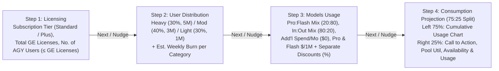

# Antigravity in Gemini Enterprise Usage Simulator

**Self link:** [go/agy-ge-usage-simulator](http://goto.google.com/agy-ge-usage-simulator)  
**Visibility:** Confidential  
**Status:** Draft  
**Authors:** [Mohan Sridharan](mailto:mohansridharan@google.com)  
**Contributors:** N/A  
**Team:** Google Cloud — JAPAC AI & Agentic Coding Enablement  
**PRD:** This document (PRD and design combined)  
**Tracking Buganizer issue/hotlist:** N/A  
**Last major revision:** 2026-10-07

---

# Context

## Objective

Provide Customer Engineers (CEs), Solution Architects, and enterprise IT administrators with a self-contained, interactive browser-based **Antigravity in Gemini Enterprise Usage Simulator** that models weekly token capacity and developer consumption across the working week (`Monday`–`Friday`).

The simulator answers four operational questions across four dedicated tabs (`Licensing` $\rightarrow$ `User Distribution` $\rightarrow$ `Models Usage` $\rightarrow$ `Consumption Projection`), guided by a **step-by-step wizard** that presents two floating buttons (**Back** and **Next**) on the UI and triggers a **UI nudge** prompting the user to advance to the next screen whenever fields in the current tab are updated:

1.  **Licensing:** Given the customer's subscription tier (`Standard` at \$10/seat/mo or `Plus` at \$15/seat/mo), procured Gemini Enterprise seats ($N_{\text{licenses}}$), and the effective **No. of AGY users** consuming Antigravity quota ($N_{\text{AGY}} \le N_{\text{licenses}}$), how many **Total Tokens per Week** and **Tokens per User per Week** are available?
2.  **User Distribution:** How does splitting the active Antigravity users across `Heavy`, `Moderate`, and `Light` usage categories (default `30%–40%–30%`) with configurable weekly token utilization per category (default `Heavy: 5M`, `Moderate: 3M`, `Light: 1M` tokens/user/week) impact total pool utilization?
3.  **Models Usage:** How do the **Thinking vs. Workhorse** model split (`Gemini Pro` vs. `Gemini Flash`, default `20:80`), the **Input : Output Tokens Mix** (default `80:20`), **Additional Spend available per month** (default \$0), public model token prices (\$/1M tokens), and independent **Pro & Flash Discount Pricing (%)** widgets shift the effective blended cost per 1M tokens and total weekly token availability?
4.  **Consumption Projection:** In a **75:25 vertical split**, how does cumulative stacked token usage across active Antigravity user categories (`Light`, `Moderate`, `Heavy`) track against the organization's **Weekly Token Quota** ceiling from `Monday` to `Friday`, and what **Call to Action** (`Capacity Available`, `Full Utilization`, or `Additional Spend Required` with indicative monthly budget) is triggered?

## Background

When enterprise customers procure **Gemini Enterprise Standard** (\$10/user/month AI credit allocation) or **Gemini Enterprise Plus** (\$15/user/month AI credit allocation), Antigravity IDE and CLI usage draws from a shared, project-level quota pool that refreshes weekly and does not roll over.

During technical readiness and procurement reviews, enterprise admins and FinOps leads consistently ask:

-   How many millions of tokens per week does our Gemini Enterprise license pool (plus any additional monthly AI spend) buy at a typical `80% Flash / 20% Pro` model mix and `80% Input / 20% Output` token ratio, with per-model negotiated discount pricing?
-   When a subset of licensed users (`No. of AGY users` $\le$ `Total # of GE Licenses`) actively uses Antigravity across `Heavy` (`30%`, `5M/wk`), `Moderate` (`40%`, `3M/wk`), and `Light` (`30%`, `1M/wk`) tiers, will weekly token availability cover usage or how much indicative monthly budget is required to close the gap?

---

# Requirements

## Information architecture

## User stories

Persona: a Google Cloud Customer Engineer (CE) or enterprise IT administrator modeling Antigravity capacity.

1.  **As an admin on Licensing,** I select `Standard` or `Plus` via radio buttons at the top of the left pane, and enter the **Total # of GE Licenses** and the effective **No. of AGY users** ($\le$ Total GE Licenses) below, while the right pane displays **Total Tokens available per week for consumption** and **Total Tokens available per user per week for consumption** (in a font size `+6px` larger than normal); once I update any field, a floating UI nudge prompts me to click **Next** to move to **User Distribution**.
2.  **As an admin on User Distribution,** I configure the percentage of active AGY users in `Heavy`, `Moderate`, and `Light` categories (default `30%–40%–30%`) and their estimated weekly token utilization per user category (default `Heavy: 5M`, `Moderate: 3M`, `Light: 1M` tokens/user/week), and receive a floating UI nudge to advance to **Models Usage** (or click **Back** to return to **Licensing**).
3.  **As an admin on Models Usage,** I configure the **Model Usage Mix** slider (`Gemini Pro` vs. `Gemini Flash`, default `20% Pro / 80% Flash`), the **Input : Output Tokens Mix** slider (default `80% Input / 20% Output`), the **Additional Spend available per month** dollar input (default \$0), the input/output token prices (\$/1M tokens) for `Gemini Pro` and `Gemini Flash`, and two separate **Discount Pricing (%)** widgets (one for `Gemini Pro` and one for `Gemini Flash`), and receive a floating UI nudge to advance to **Consumption Projection**.
4.  **As an admin on Consumption Projection,** I see a **75:25 vertical split** where the left 75% pane displays the **Cumulative usage** stacked line chart prominently at the top (without scrolling) and a merged header + legend card below, while the right 25% pane places the **Call to Action** infographic (`Capacity Available`, `Full Utilization`, or `Additional Spend Required` with the indicative monthly budget needed) and **Token Pool Utilization** widget at the top of the pane, followed by **Weekly Token Availability** (including any additional monthly spend) and **Weekly Token Usage** below.

## Functional requirements

ID | Tab | Requirement | Priority
--- | --- | --- | ---
R1 | Global | **Fixed Header, Scrollable Content, Light/Dark Mode Toggle & Colored Tab Borders:** Defaults to Dark Mode and provides a segmented **Dark / Light Mode Toggle** in the top-right header that dynamically adjusts all widget surfaces, typography, badges, slider tracks, wizard banners, and SVG chart tooltips to suit the active mode. Includes a fixed top header with an enlarged title and colored tab borders across four top-level tabs ordered as: **Licensing**, **User Distribution**, **Models Usage**, and **Consumption Projection** (last tab), while tab content scrolls independently below. | P0
R1a | Global Wizard | **Floating Back & Next Wizard Buttons + Field-Update UI Nudge:** Renders two floating navigation buttons (**Back** and **Next**) anchored in the bottom-right corner of the viewport. Whenever the user updates any input field, slider, or radio button in a given tab, an animated **UI nudge** banner and highlighted **Next** button prompt the user to advance to the next screen in sequence (`Licensing` $\rightarrow$ `User Distribution` $\rightarrow$ `Models Usage` $\rightarrow$ `Consumption Projection`). | P0
R2 | Licensing | **Subscription Tier at Top, Licenses & Active AGY Users Below:** Left 2/3rd pane places **GE Subscription Tier** radio buttons (`Standard` at \$10/mo = \$2.50/wk vs. `Plus` at \$15/mo = \$3.75/wk) at the top, followed below by **Total # of GE Licenses** (seats procured by the customer) and **No. of AGY users** (effective number of users consuming AGY Quota, constrained $\le$ Total # of GE Licenses). | P0
R3 | Licensing | **Weekly Token Capacity Display (+6px Font):** Right 1/3rd pane displays readonly values styled `+6px` larger than normal text for (a) **Total Tokens available per week for consumption** and (b) **Total Tokens available per user per week for consumption** (pooled weekly tokens divided by `No. of AGY users`). | P0
R4 | User Distribution | **User Category Distribution & Burn Widgets:** Collects (a) the `%` of users in **Heavy**, **Moderate**, and **Light** categories (defaulting to `30-40-30` with automatic 100% normalization) and (b) the estimated weekly token utilization (`M tokens/user/week`) across each category, defaulting to **Heavy users: 5M**, **Moderate users: 3M**, and **Light users: 1M**. | P0
R5 | Models Usage | **Model Usage Mix, Input:Output Mix & Additional Spend per Month Widgets:** Provides (a) the **Model Usage Mix** slider (`Gemini Pro` vs. `Gemini Flash`, default `80% Flash & 20% Pro`), (b) the **Input : Output Tokens Mix** slider (`Input Tokens` vs. `Output Tokens`, default `80% Input & 20% Output`), and (c) an **Additional Spend available per month** widget (`$ / month`, default `0`) that converts additional monthly budget into weekly token availability in the **Consumption Projection** tab based on the model usage mix and input:output mix. | P0
R6 | Models Usage | **Model Family Input & Output Pricing + Separate Pro & Flash Discount Pricing Widgets:** Collects Input and Output token prices (\$/1M tokens) for **Gemini Pro** and **Gemini Flash**, prepopulated with publicly available pricing (`Gemini Pro`: \$2.00 In / \$12.00 Out; `Gemini Flash`: \$1.50 In / \$7.50 Out), plus **two separate Discount Pricing (%) widgets** (`0%–90%`, default `0%`) — one dedicated to **Gemini Pro** and one dedicated to **Gemini Flash**. | P0
R7 | Consumption Projection | **75:25 Vertical Split — Left 75% Graph Pane (Chart First, Cumulative Usage Only):** Places the interactive stacked line chart (`X-axis` = `Monday`–`Friday`, `Y-axis` = `Tokens in Millions (M)`, **Cumulative usage** across `Light`/`Moderate`/`Heavy` categories, and static horizontal **Weekly Token Quota** line) at the top of the left 75% pane so it is prominently visible without scrolling, with a single merged header + legend box directly below the chart. | P0
R8 | Consumption Projection | **75:25 Vertical Split — Right 25% Infographics Pane (Call to Action & Token Pool Utilization at Top):** Places four vertical infographics in the right 25% pane ordered from top to bottom as: (1) **Call to Action** infographic, (2) **Token Pool Utilization** (radial gauge and variance headroom/deficit), (3) **Weekly Token Availability** (based on total GE licenses plus any `Additional Spend available per month`), and (4) **Weekly Token Usage** (based on total AGY users, with cohort share bar). | P0
R9 | Consumption Projection | **Call to Action Infographic & Indicative Monthly Budget:** Placed at the top of the right 25% pane alongside **Token Pool Utilization**, evaluates **Weekly Token Availability** ($A$) vs. **Weekly Token Usage** ($U$): (a) if $A$ is within $\pm 5\%$ of $U$ ($|A - U| / U \le 0.05$), indicates **"Full Utilization"**; (b) if $A > U$ (outside the $\pm 5\%$ band), indicates **"Capacity Available"**; (c) if $A < U$ (outside the $\pm 5\%$ band), indicates **"Additional Spend Required"**. Whenever $A < U$, computes and displays the **indicative budget required per month** ($\Delta S_{\text{mo}} = 4 \times (U - A) \times \text{Cost}_{\text{Blended}}$) to support the additional usage. | P0

---

# Design

## Mathematical model

Let:

-   $N_{\text{licenses}}$ = Total procured Gemini Enterprise licenses (`Licensing` tab)
-   $N_{\text{AGY}} \le N_{\text{licenses}}$ = Effective **No. of AGY users** consuming Antigravity quota (`Licensing` tab)
-   $Q_{\text{license,wk}} \in \{\$2.50, \$3.75\}$ = Weekly per-license credit (`Standard` = \$2.50/wk, `Plus` = \$3.75/wk)
-   $S_{\text{add,mo}} \ge 0$ (default $\$0$) = **Additional Spend available per month** (`Models Usage` tab), contributing $S_{\text{add,wk}} = S_{\text{add,mo}} / 4$ per week
-   $m_{\text{Pro}}, m_{\text{Flash}} \in [0, 1]$ ($m_{\text{Pro}} + m_{\text{Flash}} = 1$, default $0.20, 0.80$) = Model Usage Mix (`Models Usage` tab)
-   $r_{\text{in}}, r_{\text{out}} \in [0, 1]$ ($r_{\text{in}} + r_{\text{out}} = 1$, default $0.80, 0.20$) = Input : Output Tokens Mix (`Models Usage` tab)
-   $d_{\text{Pro}}, d_{\text{Flash}} \in [0, 0.90]$ (default $0, 0$) = Separate discount percentages applied to **Gemini Pro** and **Gemini Flash** pricing (`Models Usage` tab)

### 1. Effective blended token rate (\$/1M tokens)

$$\text{Cost}_{\text{Pro}} = (1 - d_{\text{Pro}}) \cdot (r_{\text{in}} \cdot P_{\text{Pro,in}} + r_{\text{out}} \cdot P_{\text{Pro,out}}), \quad \text{Cost}_{\text{Flash}} = (1 - d_{\text{Flash}}) \cdot (r_{\text{in}} \cdot P_{\text{Flash,in}} + r_{\text{out}} \cdot P_{\text{Flash,out}})$$

$$\text{Cost}_{\text{Blended}} = m_{\text{Pro}} \cdot \text{Cost}_{\text{Pro}} + m_{\text{Flash}} \cdot \text{Cost}_{\text{Flash}}$$

### 2. Weekly token availability & Call to Action budget

$$\text{License Weekly Tokens (M)} = \frac{N_{\text{licenses}} \times Q_{\text{license,wk}}}{\text{Cost}_{\text{Blended}}}, \quad \text{Additional Weekly Tokens (M)} = \frac{S_{\text{add,mo}} / 4}{\text{Cost}_{\text{Blended}}}$$

$$\text{Total Weekly Token Availability } A\text{ (M)} = \text{License Weekly Tokens (M)} + \text{Additional Weekly Tokens (M)}$$

When Weekly Token Availability $A < U$ (where $U = W_L + W_M + W_H$ is total weekly token usage), the indicative monthly budget required to support the additional usage is:

$$\text{Indicative Monthly Budget Required (\$ / mo)} = 4 \times (U - A) \times \text{Cost}_{\text{Blended}}$$

### 3. Active user distribution & stacked working-week burn

For active AGY users $N_{\text{AGY}}$ split across shares $s_H, s_M, s_L$ (default $0.30, 0.40, 0.30$) with weekly burn $B_H = 5\text{M}, B_M = 3\text{M}, B_L = 1\text{M}$ (M tokens/user/wk):

$$W_L = (N_{\text{AGY}} \cdot s_L) \cdot B_L, \quad W_M = (N_{\text{AGY}} \cdot s_M) \cdot B_M, \quad W_H = (N_{\text{AGY}} \cdot s_H) \cdot B_H$$

## Prepopulated public pricing table (Models Usage)

Model Family | Input Tokens (\$/1M) | Output Tokens (\$/1M) | Effective Rate at 80:20 In:Out (\$/1M) | Source
--- | --- | --- | --- | ---
**Gemini 3.1 Pro** | \$2.00 | \$12.00 | **\$4.00 / 1M** | [Vertex AI Pricing](https://cloud.google.com/vertex-ai/generative-ai/pricing)
**Gemini 3.8 Flash** | \$1.50 | \$7.50 | **\$2.70 / 1M** | [Vertex AI Pricing](https://cloud.google.com/vertex-ai/generative-ai/pricing)

